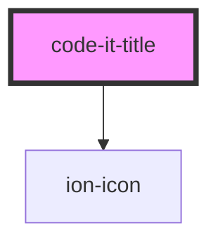

# my-component

<!-- Auto Generated Below -->

## Properties

| Property   | Attribute   | Description | Type     | Default     |
| ---------- | ----------- | ----------- | -------- | ----------- |
| `iconName` | `icon-name` |             | `string` | `undefined` |
| `text`     | `text`      |             | `string` | `undefined` |

## Dependencies

### Depends on

- ion-icon

### Graph

----------------------------------------------

*Built with [StencilJS](https://stenciljs.com/)*
